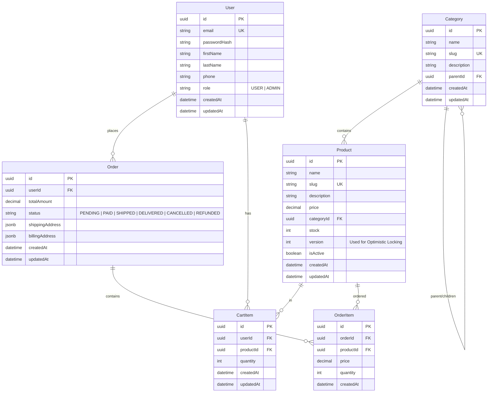

# AngoRPC 電商平台資料庫詳細設計規格書

本文件詳細規範 AngoRPC 電商平台的資料庫設計，包含實體關係圖 (ERD)、Prisma Schema 綱要定義、欄位資料字典，以及針對高併發情境下的交易安全與效能優化設計。

---

## 1. 實體關係圖 (ERD)

以下為本平台核心資料表的 Mermaid 關係圖：



---

## 2. Prisma Schema 綱要定義

以下為完整的 `schema.prisma` 代碼：

```prisma
// datasource and generator configurations
datasource db {
  provider = "postgresql"
  url      = env("DATABASE_URL")
}

generator client {
  provider = "prisma-client-js"
}

/// 用戶實體
model User {
  id           String     @id @default(uuid()) @db.Uuid
  email        String     @unique @db.VarChar(255)
  passwordHash String     @map("password_hash") @db.VarChar(255)
  firstName    String?    @map("first_name") @db.VarChar(100)
  lastName     String?    @map("last_name") @db.VarChar(100)
  phone        String?    @db.VarChar(20)
  role         UserRole   @default(USER)
  createdAt    DateTime   @default(now()) @map("created_at")
  updatedAt    DateTime   @updatedAt @map("updated_at")

  // 關係定義
  cartItems    CartItem[]
  orders       Order[]

  @@map("users")
}

enum UserRole {
  USER
  ADMIN
}

/// 商品分類實體
model Category {
  id          String     @id @default(uuid()) @db.Uuid
  name        String     @db.VarChar(100)
  slug        String     @unique @db.VarChar(100)
  description String?    @db.Text
  parentId    String?    @map("parent_id") @db.Uuid
  createdAt   DateTime   @default(now()) @map("created_at")
  updatedAt   DateTime   @updatedAt @map("updated_at")

  // 自我關聯關係
  parent      Category?  @relation("CategoryParent", fields: [parentId], references: [id], onDelete: SetNull)
  children    Category[] @relation("CategoryParent")
  
  // 關係定義
  products    Product[]

  @@map("categories")
}

/// 商品實體
model Product {
  id          String      @id @default(uuid()) @db.Uuid
  name        String      @db.VarChar(255)
  slug        String      @unique @db.VarChar(255)
  description String?     @db.Text
  price       Decimal     @db.Decimal(10, 2)
  categoryId  String      @map("category_id") @db.Uuid
  stock       Int         @default(0) @db.Integer
  version     Int         @default(0) @db.Integer // 樂觀鎖控制版本
  isActive    Boolean     @default(true) @map("is_active")
  createdAt   DateTime    @default(now()) @map("created_at")
  updatedAt   DateTime    @updatedAt @map("updated_at")

  // 關係定義
  category    Category    @relation(fields: [categoryId], references: [id], onDelete: Restrict)
  cartItems   CartItem[]
  orderItems  OrderItem[]

  // 索引設計：優化分類查詢與上架狀態篩選的複合索引
  @@index([categoryId, isActive])
  @@map("products")
}

/// 購物車項目實體 (臨時狀態，預設生命週期短)
model CartItem {
  id        String   @id @default(uuid()) @db.Uuid
  userId    String   @map("user_id") @db.Uuid
  productId String   @map("product_id") @db.Uuid
  quantity  Int      @db.Integer
  createdAt DateTime @default(now()) @map("created_at")
  updatedAt DateTime @updatedAt @map("updated_at")

  // 關係定義
  user      User     @relation(fields: [userId], references: [id], onDelete: Cascade)
  product   Product  @relation(fields: [productId], references: [id], onDelete: Cascade)

  // 複合唯一鍵防止相同商品重複新增
  @@unique([userId, productId])
  @@map("cart_items")
}

/// 訂單實體
model Order {
  id              String      @id @default(uuid()) @db.Uuid
  userId          String      @map("user_id") @db.Uuid
  totalAmount     Decimal     @map("total_amount") @db.Decimal(10, 2)
  status          OrderStatus @default(PENDING)
  shippingAddress Json        @map("shipping_address") @db.Jsonb
  billingAddress  Json        @map("billing_address") @db.Jsonb
  createdAt       DateTime    @default(now()) @map("created_at")
  updatedAt       DateTime    @updatedAt @map("updated_at")

  // 關係定義
  user            User        @relation(fields: [userId], references: [id], onDelete: Restrict)
  orderItems      OrderItem[]

  // 索引設計：優化使用者查詢自身訂單以及按時間排序的效能
  @@index([userId, createdAt])
  @@map("orders")
}

enum OrderStatus {
  PENDING
  PAID
  SHIPPED
  DELIVERED
  CANCELLED
  REFUNDED
}

/// 訂單商品明細實體
model OrderItem {
  id        String   @id @default(uuid()) @db.Uuid
  orderId   String   @map("order_id") @db.Uuid
  productId String   @map("product_id") @db.Uuid
  price     Decimal  @db.Decimal(10, 2) // 購買當下的快照價格
  quantity  Int      @db.Integer
  createdAt DateTime @default(now()) @map("created_at")

  // 關係定義
  order     Order    @relation(fields: [orderId], references: [id], onDelete: Cascade)
  product   Product  @relation(fields: [productId], references: [id], onDelete: Restrict)

  @@index([orderId])
  @@map("order_items")
}
```

---

## 3. 資料表欄位字典

### 3.1 users (用戶表)
| 欄位名稱 | 資料型態 | 允許空值 | 預設值 | 說明 |
| :--- | :--- | :--- | :--- | :--- |
| `id` | UUID | 否 | `gen_random_uuid()` | 主鍵，用戶唯一識別碼 |
| `email` | VARCHAR(255) | 否 | - | 唯一索引，登入與通知信箱 |
| `password_hash` | VARCHAR(255) | 否 | - | 雜湊加密後的密碼（採用 bcrypt 儲存） |
| `first_name` | VARCHAR(100) | 是 | NULL | 用戶名字 |
| `last_name` | VARCHAR(100) | 是 | NULL | 用戶姓氏 |
| `phone` | VARCHAR(20) | 是 | NULL | 聯絡電話 |
| `role` | VARCHAR(20) | 否 | 'USER' | 角色權限：`USER` (一般用戶), `ADMIN` (管理員) |
| `created_at` | TIMESTAMP | 否 | `NOW()` | 帳號註冊時間 |
| `updated_at` | TIMESTAMP | 否 | `NOW()` | 帳號資料最後修改時間 |

### 3.2 categories (商品分類表)
| 欄位名稱 | 資料型態 | 允許空值 | 預設值 | 說明 |
| :--- | :--- | :--- | :--- | :--- |
| `id` | UUID | 否 | `gen_random_uuid()` | 主鍵，分類唯一識別碼 |
| `name` | VARCHAR(100) | 否 | - | 分類名稱（如：服飾、3C 電子） |
| `slug` | VARCHAR(100) | 否 | - | 唯一索引，SEO 友善網址路徑名稱 |
| `description` | TEXT | 是 | NULL | 分類詳細描述描述 |
| `parent_id` | UUID | 是 | NULL | 外鍵，指向父分類 ID（支援多層級分類） |
| `created_at` | TIMESTAMP | 否 | `NOW()` | 建立時間 |
| `updated_at` | TIMESTAMP | 否 | `NOW()` | 更新時間 |

### 3.3 products (商品表)
| 欄位名稱 | 資料型態 | 允許空值 | 預設值 | 說明 |
| :--- | :--- | :--- | :--- | :--- |
| `id` | UUID | 否 | `gen_random_uuid()` | 主鍵，商品唯一識別碼 |
| `name` | VARCHAR(255) | 否 | - | 商品名稱 |
| `slug` | VARCHAR(255) | 否 | - | 唯一索引，SEO 友善商品網址路徑名稱 |
| `description` | TEXT | 是 | NULL | 商品詳細介紹與文案 |
| `price` | DECIMAL(10,2) | 否 | - | 商品售價 |
| `category_id` | UUID | 否 | - | 外鍵，所屬商品分類 ID |
| `stock` | INTEGER | 否 | 0 | 商品實體庫存量 |
| `version` | INTEGER | 否 | 0 | 樂觀鎖版本控制（高併發庫存安全） |
| `is_active` | BOOLEAN | 否 | true | 商品狀態：`true` (上架), `false` (下架) |
| `created_at` | TIMESTAMP | 否 | `NOW()` | 建立時間 |
| `updated_at` | TIMESTAMP | 否 | `NOW()` | 更新時間 |

### 3.4 cart_items (購物車明細表)
| 欄位名稱 | 資料型態 | 允許空值 | 預設值 | 說明 |
| :--- | :--- | :--- | :--- | :--- |
| `id` | UUID | 否 | `gen_random_uuid()` | 主鍵，明細項目識別碼 |
| `user_id` | UUID | 否 | - | 外鍵，所屬用戶 ID |
| `product_id` | UUID | 否 | - | 外鍵，加入之商品 ID |
| `quantity` | INTEGER | 否 | - | 加入數量（需大於 0） |
| `created_at` | TIMESTAMP | 否 | `NOW()` | 加入時間 |
| `updated_at` | TIMESTAMP | 否 | `NOW()` | 更新時間 |

### 3.5 orders (訂單主表)
| 欄位名稱 | 資料型態 | 允許空值 | 預設值 | 說明 |
| :--- | :--- | :--- | :--- | :--- |
| `id` | UUID | 否 | `gen_random_uuid()` | 主鍵，訂單唯一識別碼 |
| `user_id` | UUID | 否 | - | 外鍵，下單用戶 ID |
| `total_amount` | DECIMAL(10,2)| 否 | - | 訂單總金額（含折扣與運費） |
| `status` | VARCHAR(50) | 否 | 'PENDING' | 訂單狀態：`PENDING` (待付款), `PAID` (已付款), `SHIPPED` (已出貨), `DELIVERED` (已送達), `CANCELLED` (已取消), `REFUNDED` (已退款) |
| `shipping_address`| JSONB | 否 | - | 收件地址資訊（包含收件人、電話、地址、郵遞區號等結構） |
| `billing_address` | JSONB | 否 | - | 發票/帳單寄送地址資訊 |
| `created_at` | TIMESTAMP | 否 | `NOW()` | 下單時間 |
| `updated_at` | TIMESTAMP | 否 | `NOW()` | 訂單更新時間 |

### 3.6 order_items (訂單商品明細表)
| 欄位名稱 | 資料型態 | 允許空值 | 預設值 | 說明 |
| :--- | :--- | :--- | :--- | :--- |
| `id` | UUID | 否 | `gen_random_uuid()` | 主鍵，明細識別碼 |
| `order_id` | UUID | 否 | - | 外鍵，所屬訂單 ID |
| `product_id` | UUID | 否 | - | 外鍵，購買商品 ID |
| `price` | DECIMAL(10,2)| 否 | - | 下單當下的商品實質售價快照 |
| `quantity` | INTEGER | 否 | - | 購買數量 |
| `created_at` | TIMESTAMP | 否 | `NOW()` | 建立時間 |

---

## 4. 高併發交易與安全設計

在電商平台的秒殺或大促銷情境下，「重複扣庫存」與「超賣 (Over-selling)」是最常面臨的交易完整性風險。本系統採用多層級的保護措施：

### 4.1 資料庫層：樂觀鎖防護 (Optimistic Locking)

在核心 `Product` 模型中加入了 `version` 欄位。每次扣減庫存時，不僅確認 `stock` 是否足夠，還必須校驗並更新版本號：

```typescript
// 樂觀鎖庫存更新範例
const decreaseStock = async (productId: string, quantityToBuy: number, currentVersion: number) => {
  const result = await prisma.$executeRaw`
    UPDATE products 
    SET stock = stock - ${quantityToBuy}, version = version + 1
    WHERE id = ${productId}::uuid AND stock >= ${quantityToBuy} AND version = ${currentVersion}
  `;
  
  if (result === 0) {
    throw new Error("庫存不足，或商品已被搶購，請再試一次");
  }
};
```
* **效益**：無須對整張 `products` 表加長鎖，能承受高度併發讀取，僅在寫入衝突時拋出重試。

### 4.2 事務隔離層 (ACID Transactions)

當使用者下單結帳時，系統必須確保**「扣減庫存」**與**「建立訂單/明細」**在同一個事務中執行：

```typescript
// 結帳交易事務處理
const checkoutTransaction = async (userId: string, items: { productId: string, qty: number }[]) => {
  return await prisma.$transaction(async (tx) => {
    for (const item of items) {
      // 1. 取得目前商品資訊與版本
      const product = await tx.product.findUnique({
        where: { id: item.productId }
      });
      if (!product || product.stock < item.qty) {
        throw new Error(`商品 ${product?.name || item.productId} 庫存不足`);
      }
      
      // 2. 利用樂觀鎖扣減庫存
      const updated = await tx.$executeRaw`
        UPDATE products 
        SET stock = stock - ${item.qty}, version = version + 1
        WHERE id = ${item.productId}::uuid AND stock >= ${item.qty} AND version = ${product.version}
      `;
      if (updated === 0) {
        throw new Error("搶購太熱烈，請重新整理頁面再試");
      }
    }
    
    // 3. 建立訂單與明細...
  });
};
```

### 4.3 效能最佳化與快取預防層

對於極高併發秒殺商品：
1. **Redis 預扣庫存**：正式下單前，在 Redis 快取中透過 `DECRBY` 指令進行原子扣減。若快取回傳小於零，直接在快取層擋掉請求，保護資料庫。
2. **異步訂單隊列 (未來擴充)**：若併發極大，可將訂單寫入 Kafka / RabbitMQ，由後台 Worker 異步消化寫入 PostgreSQL。

---
*文件建立日期：2026年06月18日*
*負責人：Antigravity*
