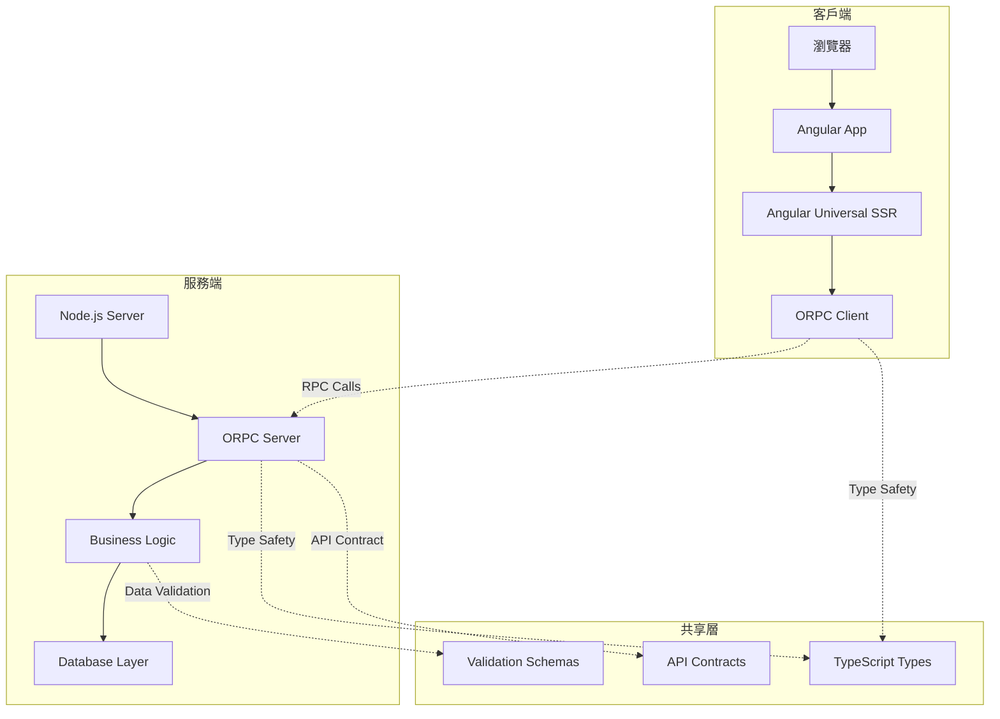

# 技術架構概述

## 整體架構設計

AngoRPC 採用前後端分離的架構，透過 ORPC 實現類型安全的通信。

## 系統架構圖



## 核心組件

### 前端組件

#### Angular Universal (SSR)
- **職責**: 服務端渲染、首屏優化
- **技術**: Angular 20, Universal
- **特點**: SEO 友善、快速載入

#### ORPC Client
- **職責**: 與後端 API 通信
- **技術**: ORPC TypeScript Client
- **特點**: 類型安全、自動生成

#### 狀態管理
- **職責**: 應用狀態管理
- **技術**: Angular Signals / NgRx (待定)
- **特點**: 響應式、可預測

### 後端組件

#### ORPC Server
- **職責**: API 服務提供
- **技術**: ORPC Node.js Server
- **特點**: 類型安全、高效能

#### 業務邏輯層
- **職責**: 核心業務邏輯
- **技術**: TypeScript Classes/Services
- **特點**: 模組化、可測試

#### 資料存取層
- **職責**: 資料庫操作
- **技術**: 待定 (Prisma/TypeORM)
- **特點**: 類型安全、ORM

## 通信流程

### 1. SSR 階段
```
1. 用戶請求頁面
2. Angular Universal 在服務端渲染
3. 呼叫 ORPC 獲取初始資料
4. 生成完整 HTML 返回
```

### 2. 客戶端水合
```
1. 瀏覽器載入 JavaScript
2. Angular 接管頁面
3. ORPC Client 建立連接
4. 狀態同步完成
```

### 3. 後續互動
```
1. 用戶操作觸發事件
2. ORPC Client 發送 RPC 請求
3. 後端處理並返回結果
4. 前端更新 UI
```

## 資料流設計

### 類型定義流程
```
1. 定義共享 TypeScript 類型
2. ORPC 自動生成 API 合約
3. 前後端使用相同類型定義
4. 編譯時類型檢查
```

### 錯誤處理流程
```
1. 後端拋出結構化錯誤
2. ORPC 序列化錯誤資訊
3. 前端接收並處理錯誤
4. 統一的錯誤顯示機制
```

## 安全考量

### 認證與授權
- JWT Token 認證
- 角色基礎存取控制 (RBAC)
- API 端點權限驗證

### 資料安全
- 輸入驗證與清理
- SQL 注入防護
- XSS 攻擊防護

### 通信安全
- HTTPS 強制使用
- CORS 適當配置
- 敏感資料加密

## 效能優化

### 前端優化
- 程式碼分割 (Code Splitting)
- 懶載入 (Lazy Loading)
- 圖片優化
- 快取策略

### 後端優化
- 資料庫查詢優化
- 快取機制
- 連線池管理
- 負載平衡

### SSR 優化
- 預渲染策略
- 部分水合
- 關鍵路徑優化

## 監控與日誌

### 應用監控
- 效能指標追蹤
- 錯誤率監控
- 使用者行為分析

### 日誌系統
- 結構化日誌
- 日誌等級分類
- 集中式日誌收集

---

最後更新：2025年10月26日
