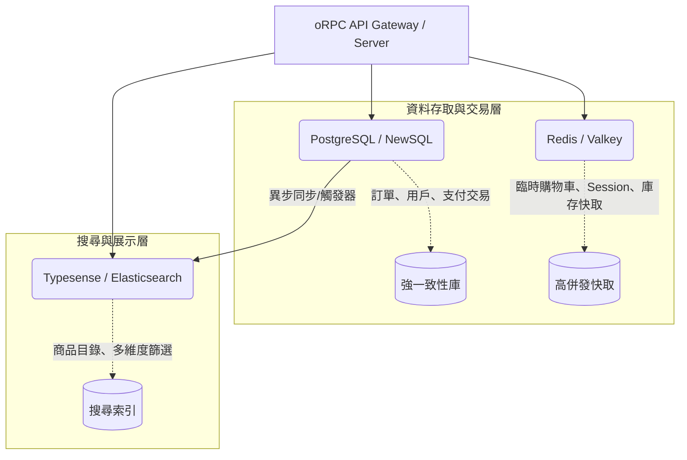

# 電商平台前後台劃分與未來擴展規劃

本文件詳細說明 AngoRPC 電商平台在「前台（Storefront）」與「後台（Admin Console）」之間的架構劃分方案，以及系統在未來的橫向與縱向擴展策略。

---

## 一、 前後台劃分方案

前台與後台的業務需求與效能側重點截然不同：
* **前台 (Storefront)**：面向終端消費者，核心要求是 **SEO 友善**、**首屏載入極快** 與 **卓越的行動端體驗**。這極度依賴 **Angular 22 SSR (伺服器端渲染)** 與漸進式水合。
* **後台 (Admin Console)**：面向商家管理員，核心要求是 **複雜資料互動**、**圖表分析** 與 **嚴格的安全權限管理**。這不需要 SEO，最適合採用 **純客戶端渲染 (CSR SPA)**，以節省伺服器效能並提升後台互動流暢度。

我們規劃了兩種前後台劃分方案，並推薦使用 **方案 B (Monorepo 多應用劃分)**。

### 方案 A：單一應用路由隔離 (Single App Route Isolation)
在同一個 Angular 應用中，透過路由 (Routing) 劃分前后台：
* **路由設計**：
  * `/products`, `/cart`, `/checkout` -> 前台路由 (啟用 SSR)
  * `/admin/**` -> 後台管理路由 (停用 SSR，僅在瀏覽器端渲染)
* **優點**：結構簡單，初期建置速度極快。
* **缺點**：
  * 後台往往會引入大型第三方套件（如 D3.js 圖表庫、複雜表格、PDF 導出工具等），容易污染前端 Bundle 大小，影響前台的首屏載入效能。
  * 前後台代碼耦合度高，權限控管邏輯較為複雜。

### 方案 B：Monorepo 多應用劃分 (Monorepo Multi-App) (推薦)
利用 Angular 22 內建的 Multi-App 支援，在同一個 Workspace (Monorepo) 中建立兩個獨立的子應用程式，並透過一個共享專案來共享型態與通用組件：

```
angorpc/ (Workspace 根目錄)
├── projects/
│   ├── storefront/            # 前台應用程式 (Angular 22 + SSR)
│   │   └── src/
│   ├── admin-portal/          # 後台管理系統 (Angular 22 - 純 CSR)
│   │   └── src/
│   └── shared-lib/            # 共享庫 (通用 UI 元件、Pipes、oRPC Client 封裝)
├── server/                    # 統一的 Express + oRPC 伺服器
└── shared/                    # 前後端共享的 TypeScript 類型與 Schemas
```

#### 為什麼推薦方案 B？
1. **效能徹底隔離**：後台的重型分析圖表與管理套件不會被打包進前台，確保前台的首屏載入時間（LCP/TTI）達到極致。
2. **部署策略靈活**：
   * **前台 (Storefront)**：部署於 Node.js SSR 伺服器，並搭配 CDN 進行 SSG 頁面快取。
   * **後台 (Admin)**：編譯成純靜態 HTML/JS/CSS，直接部署在對象存儲（如 AWS S3 / Cloudflare Pages）上，維護成本極低且天然具備高併發能力。
3. **共享開發優勢**：在 `shared-lib` 與 `shared` 中，前後台能無縫共享相同的 oRPC 類型合約與 API 呼叫服務。

---

## 二、 程式碼與路由安全防護

不論採用哪種方案，前後台的權限與安全防護必須做到「多重安全防護」：

```
┌───────────────────────────────────────────────┐
│               瀏覽器 (Client Side)            │
│  ┌──────────────────────┐                     │
│  │   Angular Route Guard│                     │
│  │   (阻擋非管理員 UI)    │                     │
│  └──────────┬───────────┘                     │
└─────────────┼─────────────────────────────────┘
              │ 透過 oRPC 呼叫 API
┌─────────────▼─────────────────────────────────┐
│               伺服器端 (Server Side)          │
│  ┌──────────────────────┐                     │
│  │  oRPC Auth Middleware│                     │
│  │  (硬性校驗 JWT 與     │                     │
│  │   資料庫權限角色)    │                     │
│  └──────────────────────┘                     │
└───────────────────────────────────────────────┘
```

1. **前端路由守衛 (Angular Router Guards)**：
   後台路由配置中必須綁定 `AdminGuard`。未登入或角色非 `ADMIN` 的用戶在前端會被重導向至登入頁。
2. **後端 oRPC 中介軟體 (Server-side Enforcement)**：
   前端的守衛僅是為了優化使用者體驗。後端 oRPC 必須在敏感 procedure 上掛載 `adminMiddleware`。每次呼叫都會校驗 JWT Token，並查詢資料庫確認該用戶的角色具有管理權限。

---

## 三、 未來的擴展策略 (Scalability Path)

隨著專案業務的擴大，系統可以朝以下方向進行橫向與縱向擴展：

### 1. API 與伺服器擴展 (從單體到 API/SSR 分離)

在初期，我們使用統一伺服器架構，單一 Node.js 執行個體同時負責前台的 SSR 渲染與後台 API 呼叫。未來流量變大時，可採取以下演進路線：

```
【階段 1：統一伺服器 (Monolith)】
┌───────────────────────────────┐
│        Node.js (Express)      │
│  [Angular SSR]  [oRPC Server] │
└───────────────────────────────┘

【階段 2：SSR 與 API 服務分離】
┌───────────────────┐       RPC      ┌───────────────────┐
│   SSR 渲染伺服器  ├───────────────►│   oRPC API 伺服器 │
│ (專注渲染 HTML)   │  (內部高速網路)│   (專注業務邏輯)  │
└───────────────────┘                └───────────────────┘

【階段 3：oRPC 微服務化 (Microservices)】
                                     ┌───────────────────┐
                                     │   oRPC API Gateway│
                                     └─────────┬─────────┘
                                   ┌───────────┼───────────┐
                                   ▼           ▼           ▼
                             ┌───────────┐┌───────────┐┌───────────┐
                             │ 商品服務  ││ 訂單服務  ││ 會員服務  │
                             └───────────┘└───────────┘└───────────┘
```

* **API 與 SSR 分離**：將 SSR 伺服器與 API 伺服器解耦。SSR 伺服器變成無狀態的渲染節點，容易進行水平擴展（Replica Sets），而 API 伺服器則可單獨進行硬體升級。
* **oRPC 路由模組化（微服務）**：oRPC 支援極佳的模組化結構。未來可將商品、訂單、會員等服務獨立成不同的 Node.js 微服務。最前方的 API Gateway 只需要匯入各個子服務的 oRPC Router 並重新組合，即可維持前端在編譯時期「一體化」的端到端類型安全體驗，而後端實際上已是分散式架構。

### 2. 資料快取與效能擴展
* **Redis 快取層**：在前台最常被瀏覽的「商品詳情」與「分類清單」API 端點，於 oRPC handler 內部引入 Redis。快取商品資訊，避免頻繁查詢 PostgreSQL。
* **PostgreSQL 讀寫分離**：配合 Prisma ORM 設定 Read Replicas，將前台大量的商品查詢（讀）分流到唯讀資料庫節點，而將建立訂單、修改商品等（寫）保留在主資料庫。

### 3. 前端部署與 SSG / CDN 擴展
* **靜態預渲染 (SSG)**：對於熱門商品頁面，可利用 Angular 22 的預渲染功能，在建置時直接生成靜態 HTML，部署到 Edge CDN (如 Cloudflare)。
* **邊緣運算渲染 (Edge SSR)**：oRPC 天然支援 Cloudflare Workers。未來若有需要，可以將部分前台渲染與 API 搬遷至 Cloudflare Workers 邊緣節點執行，讓全球用戶都能享有低於 100ms 的極速響應。

---

## 四、 未來儲存與資料庫架構瓶頸與演進評估

隨著業務規模擴大（例如商品量、併發交易量上升），除了伺服器 CPU 外，**圖片儲存與資料庫的讀寫效能**通常會是最先碰到的物理瓶頸。

### 1. 靜態檔案與圖片儲存瓶頸

* **本地儲存雷區**：將上傳的圖片直接儲存在應用伺服器本地（如 `server/public/uploads`），會導致無法水平擴充 API 節點，且傳輸大檔案會嚴重佔用伺服器網卡頻寬。
* **原圖直出與流量開銷**：若直接將未經壓縮的商品原圖（如數 MB）供前端下載，會導致首屏加載時間（LCP）變長，並產生高昂的 CDN 出站流量費（Egress Fees）。
* **最佳實踐解決方案**：
  * **物件儲存 + CDN 隔離**：使用 AWS S3、Google Cloud Storage 或 **Cloudflare R2**（免收出站流量費）。
  * **預簽名直傳 (Presigned URL)**：瀏覽器透過 API 取得預簽名連結後，直接上傳檔案至物件儲存，完全不經過 Express 伺服器，釋放伺服器頻寬。
  * **動態圖片優化**：利用 Cloudflare Images 或後端 Sharp 庫，在 CDN 邊緣動態壓縮圖片並轉換為 WebP/AVIF 格式。

### 2. 資料庫儲存瓶頸與 NoSQL / NewSQL 替代方案

當傳統單一 PostgreSQL 在大流量與大數據量下遇到瓶頸時（如行鎖競爭、單表資料破千萬），應根據業務模組引入混合持久化架構（Polyglot Persistence）：

| 業務模組 | 效能瓶頸 | 適用替代方案 | 理由與效益 |
| :--- | :--- | :--- | :--- |
| **商品目錄管理**<br>(Catalog) | 商品屬性繁多且多變，在關聯式資料庫中需設計複雜的 EAV 關係，JOIN 效能差。 | **MongoDB**<br>(文件型 NoSQL) | Schema-less，可將商品及其變體封裝在單一 JSON 文件中，讀取效能極高，Prisma 支援度佳。 |
| **購物車與 Session**<br>(State) | 生命週期短，讀寫頻率極高，容易佔用大量關聯式資料庫的連線資源。 | **Redis / Valkey**<br>(記憶體 K-V 儲存) | 微秒級響應，支援 TTL 自動過期與原子操作，非常適合存放暫存購物車與高併發庫存快取。 |
| **商品全文搜尋**<br>(Search) | 在 PostgreSQL 使用 `LIKE` 或 `GIN` 進行多維度交叉篩選（尺寸、顏色、價格）速度慢。 | **Typesense / Meilisearch / Elasticsearch**<br>(搜尋引擊) | 採用倒排索引，針對 Facet Search 進行極致優化，且提供更好的拼寫糾錯與模糊搜尋體驗。 |
| **訂單與交易**<br>(Transactional) | 訂單表與日誌表無限膨脹，歷史查詢變慢；高併發扣庫存時面臨行鎖（Row Lock）排隊。 | **PostgreSQL Partitioning** 或 **CockroachDB** (NewSQL) | - **Table Partitioning**：按月份將訂單切片，維持單表效能。<br>- **NewSQL**：具備水平擴展能力的關係型資料庫，100% 保證 ACID 交易安全。 |

### 3. 未來混合持久化演進架構圖



透過此混合架構，系統既能維持核心交易資料（訂單、支付）的強一致性，又能保障前台展示層（商品瀏覽、搜尋）的極致加載速度。

---

## 五、 基礎設施與部署架構演進路徑

為了兼顧開發效率、早期成本控制以及未來的極致擴充性，本系統在基礎設施的部署上採用**「無痛演進路徑」**。我們避免在專案初期引入過度複雜的容器編排系統（如 Kubernetes），而是透過標準 Docker 映像檔作為橋樑，逐步升級架構。

```
【開發與測試】              【中前期上線】                      【大規模運營】
┌────────────────┐          ┌─────────────────────────┐          ┌──────────────────────┐
│ Docker Compose ├─────────►│ Serverless Container    ├─────────►│ Managed Kubernetes   │
│ (本地環境一致)  │          │ (GCP Cloud Run / AWS)   │          │ (GCP GKE / AWS EKS)  │
└────────────────┘          │ - 按量計費 (可縮容至 0) │          │ - 微服務複雜調度     │
                            │ - 免維護 K8S 控制面     │          │ - 服務網格與內部通訊 │
                            └─────────────────────────┘          └──────────────────────┘
```

### 1. 階段一：開發與測試期（Docker Compose）
* **部署方式**：本地開發與 CI/CD 測試環境使用 `docker-compose`。
* **效益**：確保開發環境、測試環境與生產環境的基礎軟體版本（PostgreSQL、Redis）完全一致，避免「在我電腦上可以跑，部署上去不行」的問題。

### 2. 階段二：生產環境中前期（託管型 Serverless 容器 - 推薦方案 A）
* **部署方式**：
  * **前台 SSR 與 oRPC API**：打包成 Docker 映像檔，部署於 **GCP Cloud Run** 或 **AWS ECS Fargate**。
  * **後台 Admin Console**：編譯成純靜態網頁，部署於 **Cloudflare Pages**。
  * **資料庫與快取**：採用雲端託管服務（如 GCP Cloud SQL、AWS RDS、Upstash 等）。
* **不在此階段引入 Kubernetes (K8S) 的考量**：
  * **維運成本高**：K8S 學習曲線陡峭，需要專門的 SRE 團隊維護集群控制面、網路 CNI 與安全策略。
  * **基本開銷大**：K8S 控制面與最少工作節點有固定的「空轉成本」（每月約數百美元）。而 Cloud Run 支援「縮容至 0」，在無流量時不收費。
  * **託管容器效能已足夠**：Cloud Run 等服務已內建滾動更新、負載平衡與自動水平擴展，完全滿足中前期併發需求。

### 3. 階段三：大規模運營期（託管型 Kubernetes）
* **引入契機**：
  * 當系統微服務數量爆發（如 > 10 個獨立服務），需要複雜的內部服務發現、熔斷與服務網格（Service Mesh，如 Istio）。
  * 團隊規模擴大，有專職運維（DevOps/SRE）人員可分擔基礎設施維護。
* **效益**：提供極致的容器調度自定義能力、跨雲/混合雲部署能力。由於階段二已完成**標準 Docker 容器化**，此階段只需撰寫 K8S YAML/Helm 配置即可無痛遷移，**業務代碼完全無需重寫**。

---

最後更新：2026年06-18


