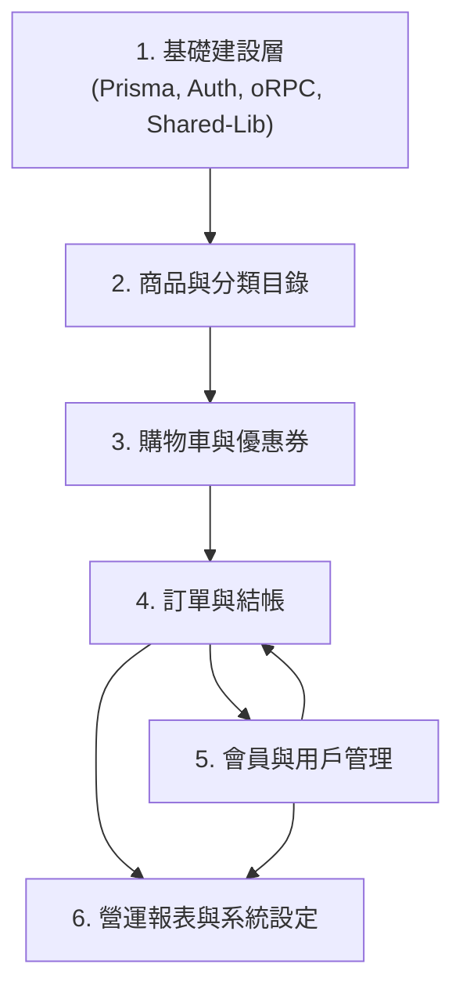

# AngoRPC 電商平台 - 系統規格與開發狀態報告

本報告根據產品需求文檔 (PRD)、詳細 API 規格書及現行專案代碼，梳理了電商平台的所有系統規格。為確保開發順暢，已將各功能模組依據**「相依性順序」**進行排列，並標註目前的**「已完成（Checked）」**與**「未完成（Pending）」**狀態。

---

## 1. 系統模組相依性拓撲

各功能模組之間的相依關係如下。相依性較高（箭頭指向）的模組，必須在基礎模組完備後才能正常開發。

*   **基礎建設層**：為整個前後端類型安全的基石，後續所有模組的 API 與 UI 皆相依於此。
*   **商品目錄**：購物車、訂單都需要關聯商品。
*   **購物車與優惠券**：購物車是成立訂單的數據來源，優惠券在結帳時需被驗證與扣抵。
*   **訂單與用戶管理**：下單需要用戶身份，而用戶管理中的「消費統計」則相依於訂單歷史。
*   **報表與設定**：營運分析與圖表資料來源為歷史訂單與用戶註冊數據。

---

## 2. 規格細節與實作狀態對照表 (依相依順序排列)

以下列出各模組下，前端（Storefront）、後端（Server / API）、管理後台（Admin Console）的具體規格需求與目前實作狀況。

| 相依階段 | 模組名稱 | 規格細節項目 | 類型與端點 | 狀態 | 備註說明 |
| :--- | :--- | :--- | :--- | :---: | :--- |
| **階段一** | **基礎建設層** | 資料庫實體 Schema 定義 | Prisma Schema | **已完成** | 包含 User, Product, Category, CartItem, Order, OrderItem, Coupon |
| | | JWT 登入狀態與權限攔截 | 後端 `authMiddleware` | **已完成** | 解析 Token 並注入 `context.user` |
| | | 端到端類型安全客戶端 | `shared-lib` 與 `shared` | **已完成** | 封裝 oRPC Client 並共享 TypeScript 型別 |
| | | 前後台路由與基礎版面 | 前端路由隔離 | **已完成** | Storefront (SSR) 與 Admin-Portal (純 CSR SPA) 結構隔離 |
| **階段二** | **商品與分類** | 查詢商品分類清單 | `product.getCategories` | **已完成** | 前台首頁導覽列與後台下拉選單皆已使用 |
| | | 前台商品目錄分頁、搜尋與過濾 | `product.getProducts` | **已完成** | 首頁包含模糊搜尋、分類篩選、價格區間篩選 |
| | | 前台商品詳情頁 | `product.getProductById` | **已完成** | 路由 `/products/:slug` 載入詳細介紹與庫存量 |
| | | 後台商品列表管理 | `product.getProducts` | **Macro已完成** | 支援分頁、模糊搜尋、上架狀態切換 (Toggle) |
| | | 後台商品新增與編輯 | `product.createProduct` / `updateProduct` | **已完成** | 具備 Reactive Form 驗證，Slug 自動生成，受 ADMIN 限制 |
| | | *[進階]* 商品多變體規格 | 尺寸、顏色、規格快照 | *待開發* | 目前商品僅支援單一價格與庫存 |
| | | *[進階]* 批量商品匯入/匯出 | CSV / Excel 匯入匯出 | *待開發* | 後台大批處理規格 |
| | | *[進階]* 商品評論與評分系統 | 消費者評價、評星 | *待開發* | PRD 2.1.1 規劃項目 |
| **階段三** | **購物車與優惠券**| 獲取購物車內容 | `cart.getCart` | **已完成** | 前台 `/cart` 路由，顯示商品數量、小計與庫存比對 |
| | | 新增商品至購物車 | `cart.addItem` | **已完成** | 首頁及詳情頁「加入購物車」按鈕，限制不能超過庫存 |
| | | 修改與移除購物車商品 | `cart.updateItem` / `removeItem` | **已完成** | 於前台購物車頁面即時修改數量與刪除項目 |
| | | 後台優惠券列表與啟用開關 | `coupon.getCoupons` / `updateCoupon` | **已完成** | 分頁列表，可直接一鍵切換 `isActive` 啟用狀態 |
| | | 後台優惠券新增與編輯 | `coupon.createCoupon` / `updateCoupon` | **已完成** | Form Modal 限制百分比面額上限（1-100%）、大寫優惠代碼轉換 |
| | | 前台套用優惠碼驗證 | `coupon.validateCoupon` | **已完成** | 結帳頁輸入優惠碼，即時回傳是否有效及折抵金額 |
| **階段四** | **訂單與結帳** | 結帳頁配送與帳單表單 | 前端 `checkout` | **已完成** | 支援收件人、電話與地址驗證，可同步配送與帳單地址 |
| | | 扣減庫存下單並成立訂單 | `order.createOrder` | **已完成** | 使用 Prisma 交易進行扣庫存、套用優惠券及寫入 OrderItem |
| | | 前台訂單歷史與狀態追蹤 | `order.getOrders` / `getOrderById` | **已完成** | 追蹤歷史訂單物流狀態 (PENDING, PAID, SHIPPED, DELIVERED等) |
| | | 後台訂單管理與雙欄詳情 | `order.getOrders` / `getOrderById` | **已完成** | 展示收寄件地址、優惠折抵明細，以 Modal 載入 |
| | | 後台修改訂單狀態 | `order.updateStatus` | **已完成** | 物流/支付狀態變更 (如出貨 `SHIPPED`、退款 `REFUNDED`等) |
| | | *[進階]* 第三方金流支付整合 | Stripe / LINE Pay / 綠界 | *待開發* | 目前下單後無實際付費跳轉流程，需手動/模擬變更已付款 |
| | | *[進階]* 發票與收據自動生成 | PDF / 電子發票 API | *待開發* | PRD 2.1.2 規劃項目 |
| | | *[進階]* 前台退貨與退款申請入口 | 消費者端提出退換貨申請 | *待開發* | 目前僅能由管理員在後台直接切換狀態 |
| **階段五** | **會員與用戶管理**| 會員註冊與登入功能 | `user.register` / `login` | **已完成** | 前台與後台的登入/註冊機制，密碼經 bcrypt 加密存檔 |
| | | 後台用戶分頁列表與角色篩選 | `user.getUsers` | **已完成** | 支援姓名/信箱模糊搜尋、管理員/一般用戶篩選 |
| | | 後台修改用戶角色與防護 | `user.updateUserRole` | **已完成** | 支援修改權限，並於前後端硬性攔截「自我降權 (Self-demotion)」 |
| | | 後台檢視用戶消費統計詳情 | `user.getUserStats` | **已完成** | 採用 Prisma `$transaction` 和聚合查詢高效率統計累計消費 |
| | | *[進階]* 個人資料編輯頁面 | 修改電話、地址簿、重設密碼 | *待開發* | 目前前台尚未有獨立的「個人資料/地址簿設定」UI 頁面 |
| | | *[進階]* 進階會員等級與積分獎勵 | 會員卡、積分扣抵、等級折扣 | *待開發* | PRD 2.1.3 規劃項目 |
| **階段六** | **報表與輔助** | *[核心]* 營運分析報表與圖表 | 後台數據分析與 Dashboard 繪製 | *待開發* | 目前後台首頁 Dashboard 為靜態佔位，未串接真實營運數據 |
| | | *[核心]* 系統設定與參數調整 | 運費門檻、基本稅率設定 | *待開發* | 尚未提供管理員調整全站參數的 UI 介面 |

---

## 3. 下一步開發推薦路線 (待實作項目排序)

為維持專案的高開發效率與功能相依順序，建議待實作項目的開發優先級如下：

1.  **金流支付整合 (Stripe 或模擬金流服務)**
    *   *原因*：有了金流，結帳流程與訂單狀態（PENDING -> PAID）才能完全閉環。
2.  **前台個人資料管理與常用地址簿**
    *   *原因*：方便用戶在結帳時直接點選常用地址，提升結帳體驗，且補足 PRD 會員基礎功能。
3.  **後台營運數據分析與 Dashboard 圖表串接**
    *   *原因*：利用 Chart.js 結合現行的 Order/User 數據，讓後台 Dashboard 脫離靜態佔位，提供商家真實營運指標。
4.  **商品變體規格 (變體庫存與多價格)**
    *   *原因*：當基礎電商流程閉環後，擴充商品的多維度規格（尺寸、顏色），使商品目錄更貼近真實商務需求。

---
*報告建立日期：2026年06月19日*
*負責人：Antigravity*
